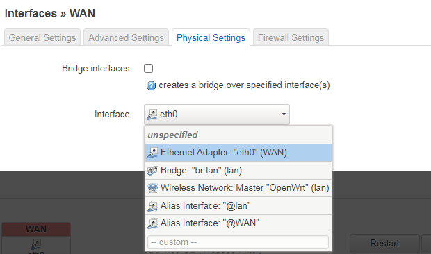
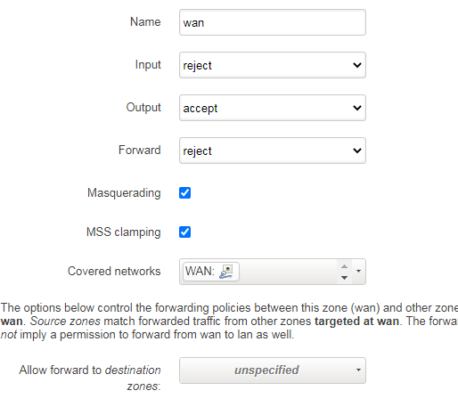
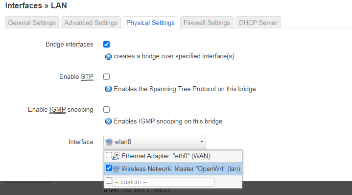
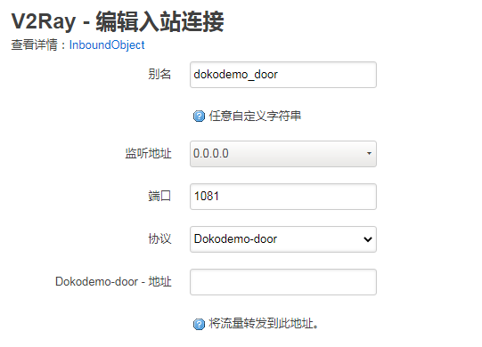
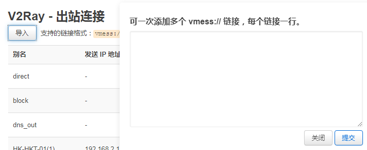
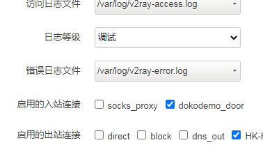
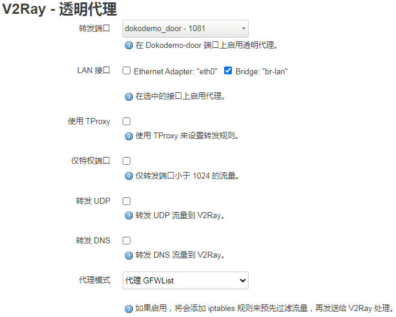
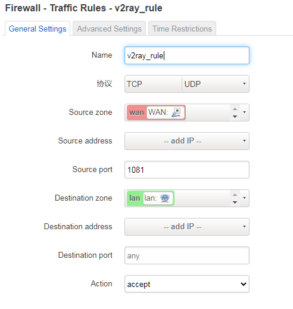

# 树莓派+openwrt+v2ray #
raspberry-openwrt-v2ray
raspberry-openwrt-v2ray 树莓派运行openwrt+v2ray
-------
## 下载 ##
- 根据自己的树莓派下载相应的img文件
- 进入openwrt官方 [这里](https://openwrt.org/toh/raspberry_pi_foundation/raspberry_pi) 可以查找
- 将img文件刷入tf卡
## 设置 ##
- 插入网线连接电脑 即可进入openwrt管理web
- 由于树莓派只有一个网口，所以我把此网口作为wan（但是默认为lan，后续需要修改）
- 进入Internet-->Wireless
- 打开无线wifi（将网口留出）
- 进入Internet-->Interface
- 看到只有一个lan接口
- 点击Add new interface添加wan口设置
- 根据自己情况选择协议
- 物理设置选择网口的接口（我这为eth0）
- 
- 进入防火墙选择最下面的wan zone进行edit
- covered network选择刚刚创建的wan接口
- 
- 配置lan口
- 将网口eth0去掉，添加wlan
- 
- 后续连接wifi进行配置

## 下载安装v2ray ##
> 前往[v2ray核心](https://github.com/kuoruan/openwrt-v2ray) 以及 [v2ray界面](https://github.com/kuoruan/luci-app-v2ray)

- **此处只提示opkg的配置**
- 首先需要更换源（清华 或者 中科大的）
- 进入system-->software
- 点击configure opkg
- 将opkg/distfeeds.conf里面的源更换为自己的源

这是我树莓派3B选的，不要憨憨的直接复制粘贴

    src/gz openwrt_core http://mirrors.tuna.tsinghua.edu.cn/openwrt/releases/19.07.4/targets/brcm2708/bcm2710/packages/
    src/gz openwrt_kmod http://mirrors.tuna.tsinghua.edu.cn/openwrt/releases/19.07.4/targets/brcm2708/bcm2710/kmods/4.14.195-1-ae418ed2395263358bbe7536d318ae28/
    src/gz openwrt_base http://mirrors.tuna.tsinghua.edu.cn/openwrt/releases/19.07.4/packages/aarch64_cortex-a53/base
    src/gz openwrt_luci http://mirrors.tuna.tsinghua.edu.cn/openwrt/releases/19.07.4/packages/aarch64_cortex-a53/luci
    src/gz openwrt_packages http://mirrors.tuna.tsinghua.edu.cn/openwrt/releases/19.07.4/packages/aarch64_cortex-a53/packages
    src/gz openwrt_routing http://mirrors.tuna.tsinghua.edu.cn/openwrt/releases/19.07.4/packages/aarch64_cortex-a53/routing
    src/gz openwrt_telephony http://mirrors.tuna.tsinghua.edu.cn/openwrt/releases/19.07.4/packages/aarch64_cortex-a53/telephony

最后Update list即可
## v2ray设置 ##
1. **入站连接**
 - 选择dokodemo_door编辑
 - 
2. **出站连接**
 - 从别的客户端导出vmess的url
 - 点击导入
 - 
3. **全局设置**
 - 勾选启用
 - 点击重载服务
 - 启用刚刚设置的入站、出站连接
 - 
 - 最后save＆apply
4. **透明代理**
 
## 防火墙设置 ##
- 进入internet-->firewall
- 找到traffic rule
- 添加规则
- 

最后开始愉快的上网吧
## P.S. 关于gfwlist无法更新的问题 ##
### 第一种情况 没有安装libustream-openssl###

- 执行opkg install libustream-openssl

### 第二种情况 更新gfwlist提示更新失败###

- 查看system log出现
	'possible DNS-rebind attack detected: raw.githubusercontent.com'
- 这是因为openwrt开启了DNS rebind protection
- 解决办法（二选一）：
- ①：关闭openwrt的DNS rebind protection
	1. 打开web管理界面 点击菜单栏Netwrok——>DHCP and DNS
	2. 关闭rebind protection选项
- ②：手动指定域名的ip地址
	1. 进入shell
	2. vi /etc/hosts
	3. 将以下代码添加进去

Code:

	52.74.223.119 github.com
    192.30.253.119gist.github.com
    54.169.195.247api.github.com
    185.199.111.153   assets-cdn.github.com
    151.101.76.133raw.githubusercontent.com
    151.101.108.133   user-images.githubusercontent.com
    151.101.76.133gist.githubusercontent.com
    151.101.76.133cloud.githubusercontent.com
    151.101.76.133camo.githubusercontent.com
    151.101.76.133avatars0.githubusercontent.com
    151.101.76.133avatars1.githubusercontent.com
    151.101.76.133avatars2.githubusercontent.com
    151.101.76.133avatars3.githubusercontent.com
    151.101.76.133avatars4.githubusercontent.com
    151.101.76.133avatars5.githubusercontent.com
    151.101.76.133avatars6.githubusercontent.com
    151.101.76.133avatars7.githubusercontent.com
    151.101.76.133avatars8.githubusercontent.com

最后:wq 保存退出
